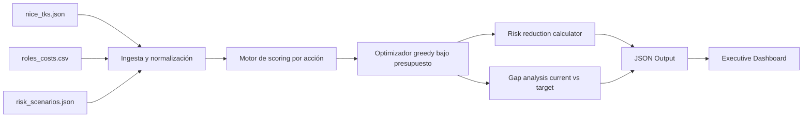

# Design Document — CISO DSS (NICE-aligned)

## 1. Executive Overview
Este documento define el diseño del CISO Decision Support System (DSS) para construir un plan de 24 meses con presupuesto restringido ($250,000), maximizando cobertura NICE TKS (Tasks/Skills/Knowledge) y cuantificando reducción de riesgo por escenario.

**Objetivo de negocio**:
- Priorizar inversiones en plantilla y capacidades (hire/upskill/outsource).
- Mostrar trazabilidad entre decisiones, cobertura NICE y reducción de riesgo.
- Soportar comunicación a comité ejecutivo mediante salida estructurada y dashboard.

---

## 2. Alcance y Entregables

1. **CLI técnico** (`dss.py`):
   - Comando `plan` para optimización.
   - Comando `gap` para análisis de brecha entre workforce actual y objetivo.
2. **Datasets de ejemplo** (`fixtures/*`): roles NICE, costos y escenarios de riesgo.
3. **Documentación ejecutiva y académica**: slides CISO y mapeo de asignaturas.

---

## 3. Arquitectura Lógica

### Componentes
- **Ingesta**: validación de estructura JSON/CSV y columnas requeridas.
- **Scoring**: pondera TKS, criticidad, impacto de riesgo y prioridad PD/DD.
- **Optimización**: selección greedy por score/costo, restricción de presupuesto y una acción por rol.
- **Análisis de riesgo**: porcentaje de tareas cubiertas por escenario.
- **Gap**: deltas de roles/tareas entre estado actual y target.

---

## 4. Modelo de Datos

### 4.1 NICE (`nice_tks.json`)
- `role_id`
- `tasks[]`
- `skills[]`
- `knowledge[]`

### 4.2 Costos (`roles_costs.csv`)
- `Role_ID`
- `Base_Salary`
- `Training_Cost`
- `Outsourcing_Cost`
- `Time_to_Hire`
- `Criticality_Score`
- `Risk_Impact`
- `Certification_Bonus_Cost`

### 4.3 Riesgo (`risk_scenarios.json`)
Escenarios requeridos:
- `Ransomware`
- `SupplyChainCompromise`
- `DataLeaks`
- `AuditFailures`

---

## 5. Modelo de Decisión

### 5.1 Fórmula base
\[
Score_{base} = w_t \cdot |Tasks| + w_s \cdot |Skills| + w_k \cdot |Knowledge|
\]

### 5.2 Ajustes de negocio
- Multiplicación por `criticality_score`.
- Multiplicación por \((1 + risk_impact/10)\).
- Multiplicador de prioridad por dominio NICE:
  - `PD`: 1.20
  - `DD`: 1.15

### 5.3 Penalización de contratación
Para acción `hire`, se aplica:
\[
HiringPenalty = max(0.4, 1 - \frac{TimeToHire}{365})
\]
Esto reduce score de roles con alta latencia de incorporación.

### 5.4 Presets oficiales
- **SOC**: `(tasks, skills, knowledge) = (1.0, 0.6, 0.3)`
- **GRC**: `(tasks, skills, knowledge) = (0.4, 0.8, 1.0)`

---

## 6. Roadmap de 2 años (Q1–Q8)

| Trimestre | Hito | Entregable | KPI esperado |
|---|---|---|---|
| Q1 | Baseline de datos | Inventario TKS + costos + riesgos | 100% fuentes integradas |
| Q2 | Primer plan DSS | Recomendación inicial hire/upskill/outsource | Plan <= presupuesto |
| Q3 | Ejecución ola 1 | Upskilling roles críticos PD/DD | +20% cobertura tasks críticas |
| Q4 | Revisión riesgo | Medición de reducción por escenario | >=15% reducción ransomware |
| Q5 | Ejecución ola 2 | Ajuste staffing + outsourcing selectivo | Lead-time medio menor |
| Q6 | Control GRC | Auditoría interna y hardening de cumplimiento | Menos hallazgos críticos |
| Q7 | Optimización final | Rebalanceo SOC/GRC según posture | Cobertura TKS estable |
| Q8 | Cierre de ciclo | Informe board + plan año 3 | ROI y riesgo residual documentado |

---

## 7. Calidad, Testing y Observabilidad

- Pruebas CLI end-to-end con `pytest`.
- Verificaciones funcionales:
  - Presupuesto no excedido.
  - Escenarios de riesgo completos.
  - `gap` con `top_missing_tasks`.
  - Diferencia de score entre `--focus soc` y `--focus grc`.

---

## 8. Limitaciones y evolución

**Limitaciones actuales**:
- Solver greedy (aproximado, no óptimo global garantizado).
- Cobertura parcial simplificada para upskill/outsource.

**Siguientes pasos**:
- Incorporar solver exacto (MILP/OR-Tools).
- Añadir sensibilidad/escenarios Monte Carlo.
- Dashboard visual web (Streamlit/Plotly) para board pack.
