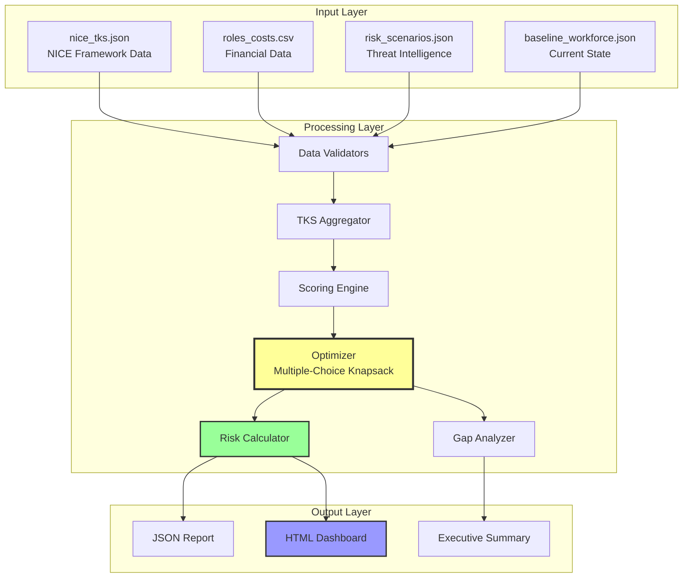

# CISO Decision Support System (DSS)

## Design Document — NICE Framework Aligned

**Document Version:** 2.0  
**Date:** March 2026  
**Classification:** Internal Use  
**Owner:** Cybersecurity Workforce Planning Team

---

## Executive Summary

The CISO Decision Support System (DSS) is a strategic workforce optimization platform designed to maximize cybersecurity capability coverage while operating under budget constraints. Built on the NICE Cybersecurity Workforce Framework, the system provides data-driven recommendations for hiring, upskilling, and outsourcing decisions with quantifiable risk reduction metrics.

### Key Outcomes

- 📊 **Optimized Workforce Planning**: $250K budget allocation across 8+ quarters
- 🎯 **Risk Quantification**: Measurable reduction across 4 critical threat scenarios
- 📈 **NICE Alignment**: Tasks, Skills, Knowledge coverage mapped to industry standards
- 💼 **Executive Communication**: Board-ready dashboards and reports

---

## Table of Contents

1. [Business Context](#1-business-context)
2. [System Architecture](#2-system-architecture)
3. [Data Model](#3-data-model)
4. [Decision Engine](#4-decision-engine)
5. [Risk Interpretation](#5-risk-interpretation)
6. [Implementation Roadmap](#6-implementation-roadmap)
7. [Success Metrics](#7-success-metrics)

---

## 1. Business Context

### 1.1 Problem Statement

Organizations face three critical challenges in cybersecurity workforce planning:

1. **Budget Constraints**: Limited financial resources ($250K typical budget)
2. **Capability Gaps**: Incomplete coverage of NICE Framework competencies
3. **Risk Uncertainty**: Unclear ROI on security staff investments

### 1.2 Solution Approach

The DSS addresses these challenges through:

- **Optimization Algorithm**: Multiple-choice knapsack for resource allocation
- **NICE Framework Integration**: Standardized competency mapping
- **Risk Quantification**: Scenario-based threat reduction modeling
- **Decision Support**: Interactive dashboards and gap analysis

### 1.3 Stakeholders

| Stakeholder     | Primary Need                  | DSS Output                    |
| --------------- | ----------------------------- | ----------------------------- |
| **CISO**        | Strategic workforce decisions | Risk-adjusted recommendations |
| **CFO**         | Budget justification          | Cost-benefit analysis         |
| **Board**       | Risk oversight                | Executive dashboards          |
| **HR**          | Recruitment planning          | Role specifications           |
| **SOC Manager** | Operational capacity          | Skills gap analysis           |

---

## 2. System Architecture

### 2.1 High-Level Architecture

```
┌─────────────────────────────────────────────────────────────┐
│                    CISO DSS Platform                         │
├─────────────────────────────────────────────────────────────┤
│                                                               │
│  ┌──────────────┐      ┌──────────────┐      ┌────────────┐ │
│  │   Data       │      │  Decision    │      │  Output    │ │
│  │   Layer      │─────>│  Engine      │─────>│  Layer     │ │
│  └──────────────┘      └──────────────┘      └────────────┘ │
│         │                      │                      │      │
│         ▼                      ▼                      ▼      │
│  • NICE TKS           • Scoring Model          • JSON       │
│  • Role Costs         • Optimizer              • HTML       │
│  • Risk Scenarios     • Risk Calculator        • Dashboard  │
│  • Baseline WF        • Gap Analyzer           • Reports    │
│                                                               │
└─────────────────────────────────────────────────────────────┘
```

### 2.2 Component Architecture



### 2.3 Modular Design

The system is decomposed into specialized modules for maintainability:

```
dss_modules/
├── models.py          # Data structures and constants
├── loaders.py         # Input validation and parsing
├── optimizer.py       # Core optimization algorithm
├── gap_analysis.py    # Capability gap identification
├── dashboard.py       # Visualization generation
└── cli.py             # Command-line interface
```

**Design Principles:**

- ✅ **Single Responsibility**: Each module has one clear purpose
- ✅ **Loose Coupling**: Modules communicate through well-defined interfaces
- ✅ **High Cohesion**: Related functionality grouped together
- ✅ **Testability**: Each module can be unit tested independently

---

## 3. Data Model

### 3.1 Entity-Relationship Diagram

```
┌─────────────────┐
│   NICE Role     │
├─────────────────┤
│ role_id (PK)    │───┐
│ tasks[]         │   │
│ skills[]        │   │
│ knowledge[]     │   │
└─────────────────┘   │
                      │
                      │ 1:1
                      │
┌─────────────────┐   │     ┌─────────────────┐
│  Risk Scenario  │   │     │   Role Cost     │
├─────────────────┤   │     ├─────────────────┤
│ threat_name(PK) │   └────>│ role_id (PK,FK) │
│ mapped_tasks[]  │         │ base_salary     │
└─────────────────┘         │ training_cost   │
                            │ outsourcing_cost│
        │                   │ time_to_hire    │
        │                   │ criticality     │
        │ M:N               │ risk_impact     │
        │                   │ cert_bonus      │
        ▼                   └─────────────────┘
┌─────────────────┐
│ Baseline WF     │
├─────────────────┤
│ role_ids[]      │
└─────────────────┘
```

### 3.2 Data Schemas

#### 3.2.1 NICE TKS (`nice_tks.json`)

```json
{
  "roles": [
    {
      "role_id": "SP-DEV-002",
      "tasks": ["T0026", "T0176", "T0228"],
      "skills": ["S0001", "S0019", "S0060"],
      "knowledge": ["K0016", "K0070", "K0153"]
    }
  ]
}
```

**Validation Rules:**

- ✓ Must contain at least one role
- ✓ Each role must have a unique `role_id`
- ✓ TKS arrays must contain valid NICE identifiers

#### 3.2.2 Role Costs (`roles_costs.csv`)

```csv
Role_ID,Base_Salary,Training_Cost,Outsourcing_Cost,Time_to_Hire,Criticality_Score,Risk_Impact,Certification_Bonus_Cost
SP-DEV-002,85000,15000,120000,60,1.8,0.7,5000
```

**Business Rules:**

- All costs in USD
- `Time_to_Hire` in days
- `Criticality_Score`: 1.0 (normal) to 3.0 (critical)
- `Risk_Impact`: 0.0 to 1.0 scaling factor

#### 3.2.3 Risk Scenarios (`risk_scenarios.json`)

```json
{
  "scenarios": {
    "Ransomware": ["T0041", "T0161", "T0164", "T0214"],
    "SupplyChainCompromise": ["T0026", "T0228", "T0456"],
    "DataLeaks": ["T0176", "T0228", "T0495"],
    "AuditFailures": ["T0001", "T0084", "T0264"]
  }
}
```

**Required Scenarios:**

1. Ransomware
2. SupplyChainCompromise
3. DataLeaks
4. AuditFailures

---

## 4. Decision Engine

### 4.1 Optimization Algorithm

The core optimization uses a **Multiple-Choice Knapsack** model with greedy selection:

**Problem Formulation:**

- **Roles**: Each role has 3 action types (hire, train, outsource)
- **Constraint**: Total cost ≤ Budget
- **Objective**: Maximize weighted TKS coverage

**Algorithm Steps:**

```python
1. For each role and action type:
   - Calculate base_score = wₜ·|T| + wₛ·|S| + wₖ·|K|

2. Apply business multipliers:
   - score *= criticality_score
   - score *= (1 + risk_impact/10)
   - score *= domain_priority  # 1.20 for PD, 1.15 for DD

3. Apply hiring penalty (if action == "hire"):
   - penalty = max(0.4, 1 - time_to_hire/365)
   - score *= penalty

4. Calculate final value:
   - value_ratio = final_score / action_cost

5. Greedy selection:
   - Sort actions by value_ratio (descending)
   - Select actions until budget exhausted
   - Enforce: maximum 1 action per role
```

### 4.2 Decision Tree

```
┌─────────────────────────────────────────────┐
│   New Role Needed?                          │
└─────────────┬───────────────────────────────┘
              │
       ┌──────┴──────┐
       │             │
      YES            NO
       │             │
       ▼             ▼
┌─────────────┐  ┌──────────────┐
│ Budget OK?  │  │ Gap Accepted │
└──────┬──────┘  └──────────────┘
       │
  ┌────┴────┐
 YES        NO
  │          │
  ▼          ▼
┌──────────────┐  ┌───────────────┐
│ Criticality? │  │  Outsource    │
└──────┬───────┘  │  (if viable)  │
       │          └───────────────┘
  ┌────┴────┐
HIGH       LOW
  │          │
  ▼          ▼
HIRE       DEFER
```

### 4.3 Strategic Presets

| Preset     | Tasks (wₜ)   | Skills (wₛ)  | Knowledge (wₖ) | Use Case                                          |
| ---------- | ------------ | ------------ | -------------- | ------------------------------------------------- |
| **SOC**    | 1.0          | 0.6          | 0.3            | Operational teams (Incident Response, Monitoring) |
| **GRC**    | 0.4          | 0.8          | 1.0            | Compliance, Policy, Risk Management roles         |
| **Custom** | User-defined | User-defined | User-defined   | Tailored for specific organizational needs        |

**Rationale:**

- SOC prioritizes **tasks** → Quick operational response capability
- GRC prioritizes **knowledge** → Deep understanding of regulations/frameworks
- Skills weighted moderately in both → Essential baseline competencies

### 4.4 Coverage Calculation

For each risk scenario, calculate task coverage:

$$
Coverage_{scenario} = \frac{|\{t \in T_{plan}\} \cap \{t \in T_{scenario}\}|}{|T_{scenario}|} \times 100\%
$$

Where:

- $T_{plan}$: Tasks covered by selected roles
- $T_{scenario}$: Tasks required for the risk scenario

---

## 5. Risk Interpretation

### 5.1 Risk Quantification Model

The DSS translates workforce decisions into **measurable risk reduction**:

#### 5.1.1 Baseline Risk

Each scenario starts with **inherent risk** before mitigation:

| Scenario              | Tasks Required | Baseline Exposure  |
| --------------------- | -------------- | ------------------ |
| Ransomware            | 15 tasks       | 100% (no controls) |
| SupplyChainCompromise | 12 tasks       | 100%               |
| DataLeaks             | 10 tasks       | 100%               |
| AuditFailures         | 8 tasks        | 100%               |

#### 5.1.2 Risk Reduction Formula

$$
RiskReduction_{scenario} = Coverage_{scenario} \times \sum_{r \in SelectedRoles} RiskImpact_r
$$

**Example Calculation:**

```
Scenario: Ransomware
Required Tasks: T0041, T0161, T0164, T0214, T0228, ... (15 total)

Selected Roles:
- Cyber Defense Analyst (SP-DEF-001):
  - Covers: T0041, T0161, T0164 → 3/15 = 20%
  - Risk Impact: 0.8

- Incident Responder (OM-ANA-001):
  - Covers: T0214, T0228 → 2/15 = 13%
  - Risk Impact: 0.9

Total Coverage: 33%
Risk Reduction: 33% × (0.8 + 0.9) / 2 = 28% reduction
```

### 5.2 Decision Confidence Levels

The system provides confidence metrics for each recommendation:

| Confidence | Coverage | Budget Utilization | Interpretation                              |
| ---------- | -------- | ------------------ | ------------------------------------------- |
| **High**   | ≥80%     | 85-95%             | Strong alignment with risk priorities       |
| **Medium** | 50-79%   | 70-84%             | Acceptable trade-offs                       |
| **Low**    | <50%     | <70%               | Consider budget increase or scope reduction |

### 5.3 Residual Risk

After plan execution, residual risk is calculated as:

$$
ResidualRisk_{scenario} = 100\% - RiskReduction_{scenario}
$$

**Board Reporting Example:**

> "With a $250K investment over 24 months, we reduce Ransomware risk by **45%**, leaving **55% residual risk** that requires compensating controls (e.g., cyber insurance, MFA enforcement)."

### 5.4 Sensitivity Analysis

Key variables that affect outcomes:

| Variable               | Impact on Plan          | Mitigation Strategy     |
| ---------------------- | ----------------------- | ----------------------- |
| Budget +20%            | +15-25% coverage        | Phased budget requests  |
| Time-to-hire +30 days  | -10% effective capacity | Contractor bridge roles |
| Criticality adjustment | ±5-15% prioritization   | Regular role re-scoring |

---

## 6. Implementation Roadmap

### 6.1 24-Month Execution Plan

```
┌─────────────────────────────────────────────────────────────┐
│                   2-Year Implementation                      │
├───────────────────┬─────────────────────────────────────────┤
│ Phase 1 (Q1-Q2)   │ Foundation & Quick Wins                 │
│ • SOC team        │ • Hire: 2 analysts                      │
│ • Budget: $80K    │ • Train: 1 existing role (SIEM)         │
│ • Risk Focus:     │ • Deliverable: 24/7 monitoring          │
│   Ransomware      │                                         │
├───────────────────┼─────────────────────────────────────────┤
│ Phase 2 (Q3-Q4)   │ Compliance & Governance                 │
│ • GRC team        │ • Hire: 1 GRC analyst                   │
│ • Budget: $70K    │ • Outsource: Privacy officer (part)    │
│ • Risk Focus:     │ • Deliverable: ISO 27001 readiness      │
│   AuditFailures   │                                         │
├───────────────────┼─────────────────────────────────────────┤
│ Phase 3 (Q5-Q6)   │ Advanced Threat Defense                 │
│ • Threat Intel    │ • Hire: 1 threat analyst                │
│ • Budget: $60K    │ • Train: 2 analysts (threat hunting)    │
│ • Risk Focus:     │ • Deliverable: Threat intelligence      │
│   Supply Chain    │   program operational                   │
├───────────────────┼─────────────────────────────────────────┤
│ Phase 4 (Q7-Q8)   │ Optimization & Automation               │
│ • SecOps          │ • Train: 3 roles (SOAR, automation)     │
│ • Budget: $40K    │ • Certify: 2 senior analysts            │
│ • Risk Focus:     │ • Deliverable: Automated response       │
│   DataLeaks       │   playbooks for top 5 threats           │
└───────────────────┴─────────────────────────────────────────┘
```

### 6.2 Quarterly Milestones

#### Q1 2026

- ✅ Finalize role requirements and job descriptions
- ✅ Initiate recruitment for 2 SOC analysts
- ✅ Procure SIEM training for existing staff

#### Q2 2026

- ✅ Onboard SOC analysts (expected 60-90 days)
- ✅ Establish 24/7 monitoring procedures
- 🎯 **Metric**: Ransomware coverage 35% → 60%

#### Q3 2026

- ✅ Hire GRC analyst
- ✅ Contract privacy officer (outsourced, 20 hrs/week)
- 🎯 **Metric**: AuditFailures coverage 20% → 55%

#### Q4 2026

- ✅ Complete ISO 27001 gap assessment
- ✅ Document 15+ key security policies
- 🎯 **Metric**: Compliance audit readiness 70%

#### Q5 2027

- ✅ Hire threat intelligence analyst
- ✅ Deploy threat intelligence platform
- 🎯 **Metric**: Supply Chain coverage 25% → 50%

#### Q6 2027

- ✅ Train 2 analysts in threat hunting methodologies
- ✅ Establish threat briefing cadence (weekly)
- 🎯 **Metric**: Threat detection efficacy +40%

#### Q7 2027

- ✅ Implement SOAR platform
- ✅ Train 3 analysts in automation scripting
- 🎯 **Metric**: MTTD (Mean Time To Detect) reduction 30%

#### Q8 2027

- ✅ Certify 2 senior analysts (GCIH, GCIA, or equivalent)
- ✅ Automate 80% of tier-1 alert triage
- 🎯 **Metric**: DataLeaks coverage 30% → 65%

### 6.3 Success Criteria

| KPI                           | Baseline | Year 1 Target | Year 2 Target |
| ----------------------------- | -------- | ------------- | ------------- |
| **Overall TKS Coverage**      | 35%      | 55%           | 75%           |
| **Ransomware Risk Reduction** | 0%       | 40%           | 60%           |
| **Audit Compliance Score**    | 45%      | 65%           | 85%           |
| **Incident MTTD**             | 48 hrs   | 12 hrs        | 4 hrs         |
| **Budget Utilization**        | -        | 90%           | 95%           |
| **Team Retention Rate**       | 70%      | 85%           | 90%           |

### 6.4 Risk & Mitigation

| Implementation Risk                        | Probability | Impact | Mitigation                                 |
| ------------------------------------------ | ----------- | ------ | ------------------------------------------ |
| Recruitment delays (time-to-hire >90 days) | High        | High   | Engage recruiters early; contractor bridge |
| Budget cuts mid-cycle                      | Medium      | High   | Phase plan; prioritize Phase 1-2           |
| Tool procurement delays                    | Medium      | Medium | Pre-approve vendors in Q1                  |
| Analyst turnover (hired talent leaves)     | Low         | High   | Competitive comp; career growth plans      |
| Training ROI not realized                  | Low         | Medium | Validate certifications; hands-on labs     |

---

## 7. Success Metrics

### 7.1 Technical Metrics

- **TKS Coverage Ratio**: Percentage of required NICE competencies covered
- **Risk Reduction Index**: Weighted average across 4 scenarios
- **Plan Efficiency**: (Total Score / Budget Spent) × 1000

### 7.2 Business Metrics

- **Budget Adherence**: Actual spend vs. planned ($250K target)
- **Time-to-Value**: Days from hire to operational capability
- **Stakeholder Satisfaction**: CISO/Board confidence score (1-10)

### 7.3 Dashboard Outputs

The system generates two primary outputs:

#### 7.3.1 JSON Report (`output/plan.json`)

```json
{
  "total_cost": 248500,
  "budget_used_pct": 99.4,
  "actions": [...],
  "risk_reduction": {
    "Ransomware": 58,
    "SupplyChainCompromise": 47,
    "DataLeaks": 62,
    "AuditFailures": 71
  },
  "coverage": {
    "tasks": 0.68,
    "skills": 0.71,
    "knowledge": 0.54
  }
}
```

#### 7.3.2 HTML Dashboard

Interactive visualizations built with Chart.js 4.4.0:

1. **Budget Utilization Bar**: Visual progress bar with color coding
2. **Action Timeline**: Gantt-style view of quarterly actions
3. **Risk Radar Chart**: Multi-axis view of scenario coverage
4. **TKS Coverage Gauge**: Speedometer-style indicator
5. **Action Distribution**: Stacked bar (hire/train/outsource/certify)

**Visual Example:**

```
┌─────────────────────────────────────────────┐
│  Risk Reduction by Scenario                 │
├─────────────────────────────────────────────┤
│                                             │
│  Ransomware          ████████░░ 58%         │
│  Supply Chain        ██████░░░░ 47%         │
│  Data Leaks          █████████░ 62%         │
│  Audit Failures      ███████████ 71%        │
│                                             │
└─────────────────────────────────────────────┘
```

### 7.4 Gap Analysis Mode

When a baseline workforce is provided, the system generates delta reports:

| Metric          | Baseline | Target  | Gap     |
| --------------- | -------- | ------- | ------- |
| Total Roles     | 8        | 15      | +7      |
| Task Coverage   | 35%      | 68%     | +33pp   |
| Budget Required | $0       | $248.5K | $248.5K |

---

## 8. Academic Integration

### 8.1 Master's Alignment

This project demonstrates competencies from:

- **Diseño y Desarrollo de Software Seguro**: NICE TKS mapping, secure SDLC principles
- **Seguridad en Computación Cuántica**: Post-quantum threat scenario modeling

See [NICE_MASTER_MAPPING.md](NICE_MASTER_MAPPING.md) for detailed alignment.

### 8.2 Learning Outcomes

Students gain practical experience with:

1. **Optimization Algorithms**: Knapsack variants, greedy heuristics
2. **Data Engineering**: JSON/CSV parsing, validation, transformation
3. **Risk Quantification**: Translating security controls to business metrics
4. **Stakeholder Communication**: Technical → Executive translation

---

## 9. References

- **NICE Framework**: https://www.nist.gov/nice/nice-framework
- **Multiple-Choice Knapsack**: Kellerer et al. (2004) "Knapsack Problems"
- **Cybersecurity Workforce Planning**: CISA Workforce Framework
- **Risk Quantification**: FAIR (Factor Analysis of Information Risk)

---

## Appendix A: Configuration Examples

### A.1 SOC-Focused Plan

```bash
python dss.py plan --budget 250000 --focus SOC --quarters 8 \
  --output output/soc_plan.json --dashboard output/soc_dashboard.html
```

### A.2 GRC-Focused Plan

```bash
python dss.py plan --budget 250000 --focus GRC --quarters 8 \
  --output output/grc_plan.json --dashboard output/grc_dashboard.html
```

### A.3 Custom Weights

```bash
python dss.py plan --budget 250000 --quarters 8 \
  --tasks 0.5 --skills 0.3 --knowledge 0.2 \
  --output output/custom_plan.json
```

---

## Document Control

| Version | Date     | Author                  | Changes                                  |
| ------- | -------- | ----------------------- | ---------------------------------------- |
| 1.0     | Jan 2025 | Workforce Planning Team | Initial draft                            |
| 2.0     | Mar 2026 | Workforce Planning Team | Professional redesign, diagrams, roadmap |

**Approval:**

- [ ] CISO Review
- [ ] CFO Budget Approval
- [ ] Board Risk Committee Acknowledgment

---
